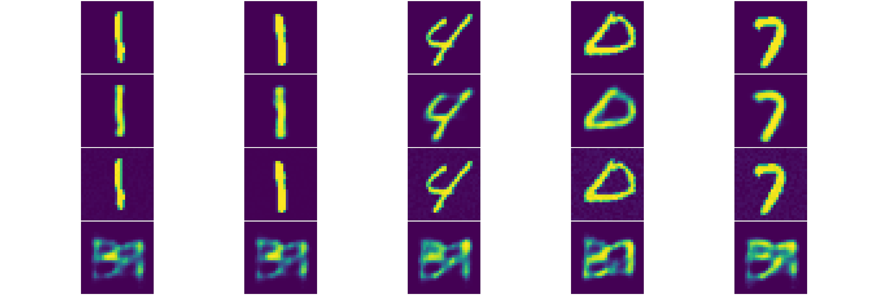
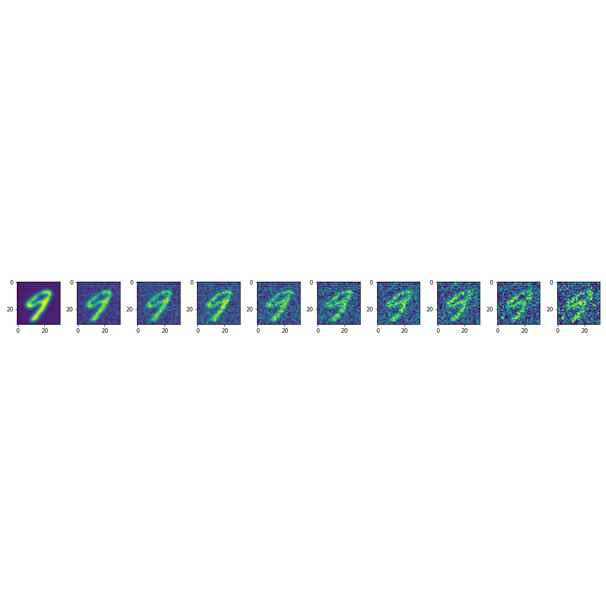
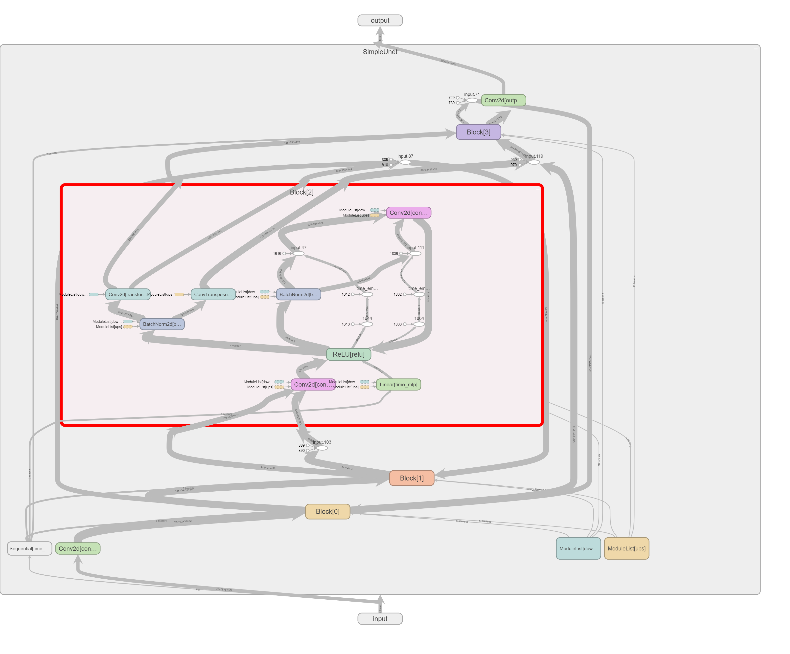
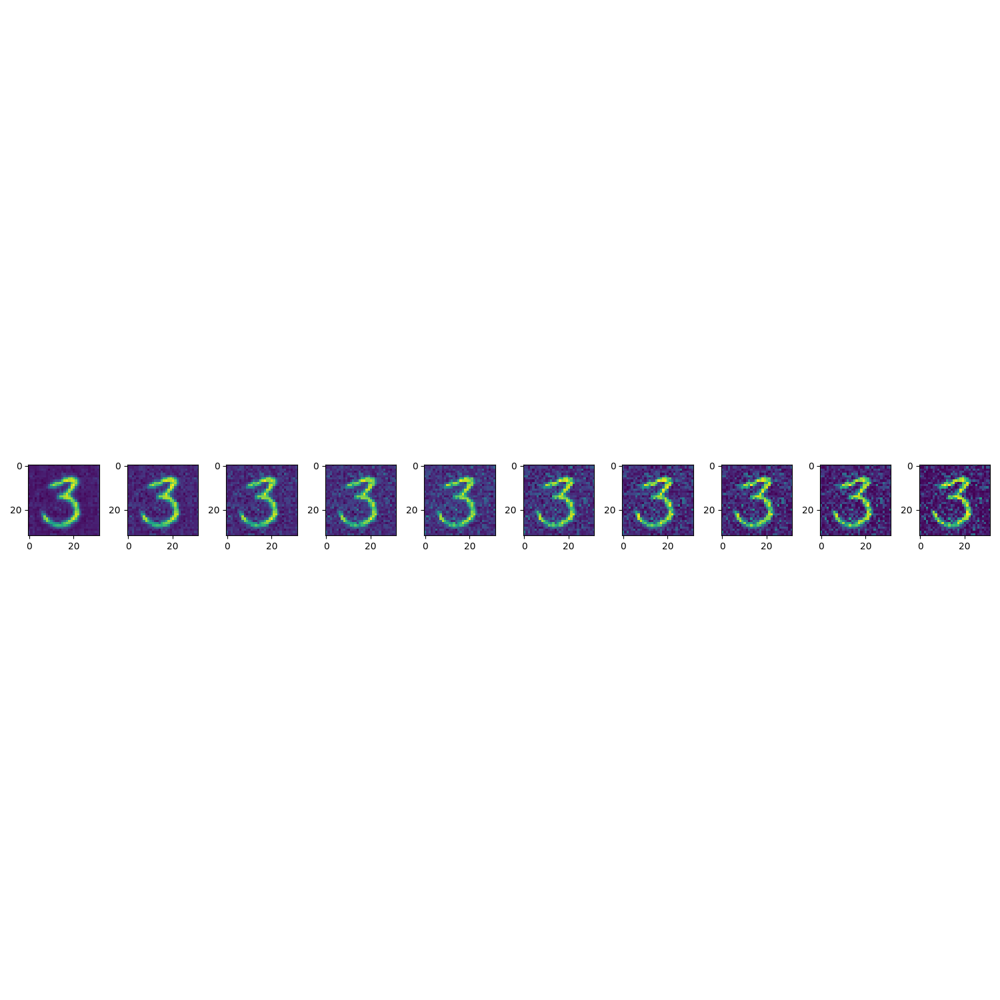
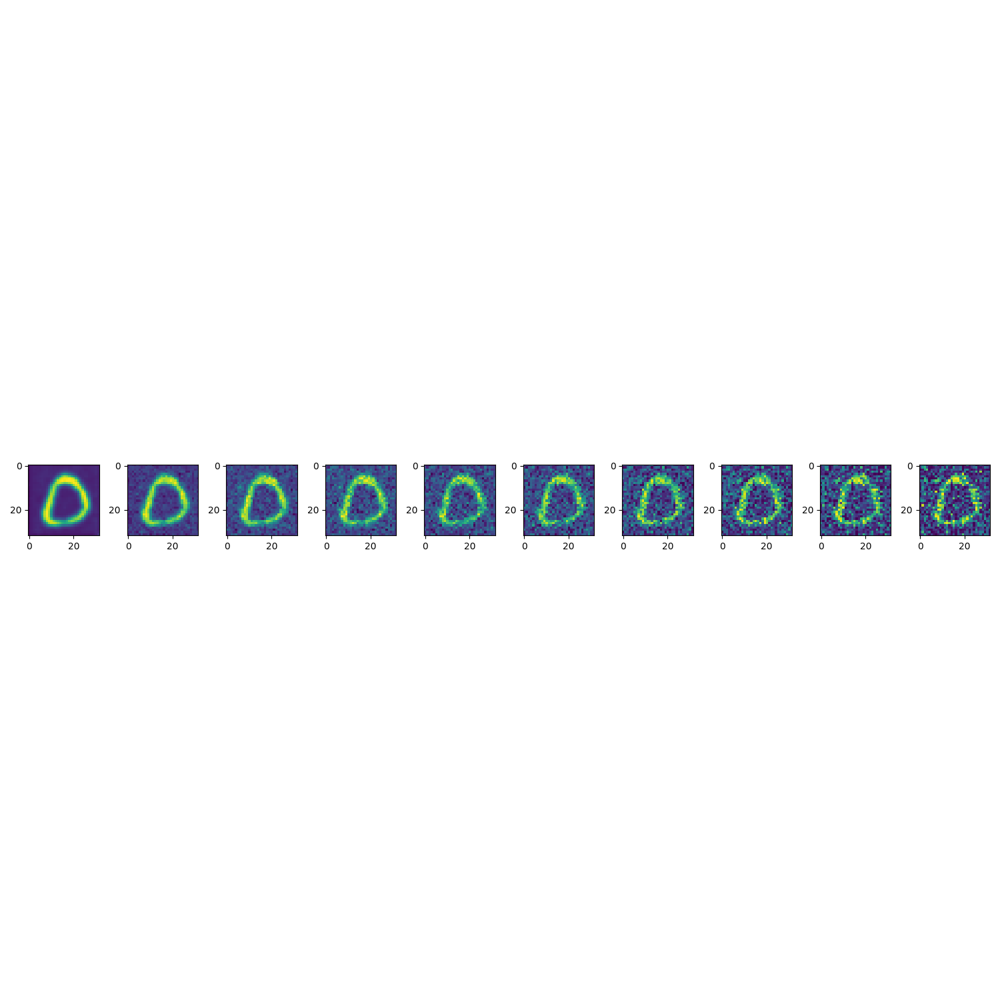
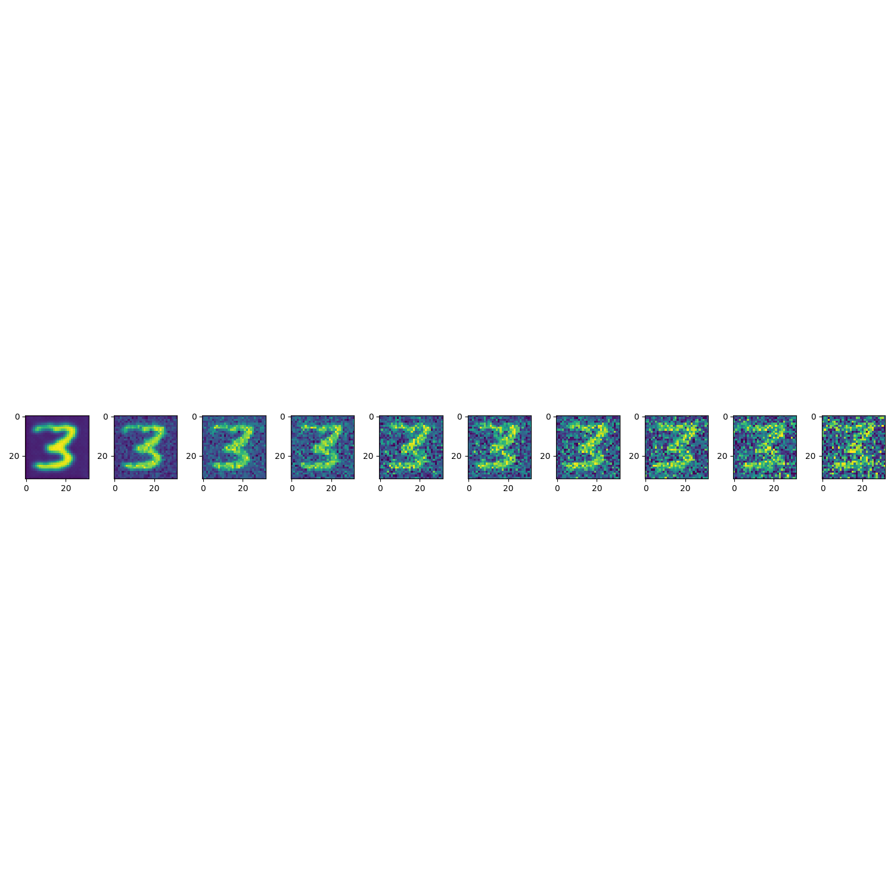

## Denoise images from MNIST
### Introduction and my personal ideal
   First I tried a VAE autoencoder. It has the ability to reconstruct the picture from the latent space, and is pretty easy to train on the MNIST dataset. However, it cannot denoise the image from an noisy image.
> 
FIG_1: First line of pictures are the origin pictures, the second line of pictures are the images which reconstructed by VAE from the origin pictures,  the third line of the pictures are the noisy version of the origin pictures, the final line of the pictures are the images which reconstructed by VAE from the noisy pictures.

  Fig1 shows VAE network cannot handle the noisy input pictures. Because the VAE is tried to memorize the images in the dataset, and a noisy image does not belongs to the dataset. The VAE is try to use the encoder find the points in the latent space which represent the images in the dataset, then use the decoder to reconstruct, so when giving it a image doesn't belongs to the training dataset, it cannot find the proper point in the latent space, thus cannot use the decoder to reconstruct the image. May be a lossy encoding can solve the problem by ignoring the noise in the image, but my VAE didn't solve the problem. 
        
  After realized the VAE network cannot performs well on this project, I thought may be the diffusion model can solve this problem.
> #### A brief introduction to the Diffusion model
>  Diffusion model is a model that not reconstruct the picture in just one time but several times instead, each time it removes a little bit of noise in the image, after running plenty of times, it can remove all the noise in the image. If the input is a pure noisy image, it can generate a new picture from the input which doesn't belong to the dataset. 
        
   By consider the input noisy image as a image in the middle of the pure noisy and the input image, we can use the diffusion progress to remove the noise in the input image and reconstruct the image. Here are some of the result
> 
FIG_2: the picture on the right is the input noisy image, and the picture on the left is the result diffusion model gives.

### Diffusion model (explaination from https://en.wikipedia.org/wiki/Diffusion_model)
  In machine learning, diffusion models, also known as diffusion probabilistic models or score-based generative models, are a class of latent variable generative models. A diffusion model consists of three major components: the forward process, the reverse process, and the sampling procedure. The goal of diffusion models is to learn a diffusion process that generates the probability distribution of a given dataset. They learn the latent structure of a dataset by modeling the way in which data points diffuse through their latent space.

  In the case of computer vision, diffusion models can be applied to a variety of tasks, including image denoising, inpainting, super-resolution, and image generation. This typically involves training a neural network to sequentially denoise images blurred with Gaussian noise. The model is trained to reverse the process of adding noise to an image. After training to convergence, it can be used for image generation by starting with an image composed of random noise for the network to iteratively denoise. Announced on 13 April 2022, OpenAI's text-to-image model DALL-E 2 is an example that uses diffusion models for both the model's prior (which produces an image embedding given a text caption) and the decoder that generates the final image. Diffusion models have recently found applications in natural language processing (NLP), particularly in areas like text generation and summarization.

  Diffusion models are typically formulated as markov chains and trained using variational inference. Examples of generic diffusion modeling frameworks used in computer vision are denoising diffusion probabilistic models, noise conditioned score networks, and stochastic differential equations.
        
### My personal understanding towards Diffusion model and the modification

  In diffusion model we consider the noise image is generated by a noisyless picture through a markov chain, which gives us a chance to remove the noise through a opposite progress. The markov chain also gives us a chance to not to insert the noise many times in order to turn a image to a noise image, instead the markov chain provide a mathematical proof to generate the noise image in one time. Here I'm not going to give a mathiematical proof here, because I don't think I can explain better than this paper "Denoising Diffusion Probabilistic Models" 

  So what we do in the training progress of diffusion model is that generating a $T$ level noisy image and then send it to the U-net to get a predicted noise distribute. Then use the loss function to judge the distance of the noise added and the predicted noise. When we need to reconstruct the image, we need to inverse the Markov chain, and after minus the predicted noise in each step, we need to add another standard normal distribution noise to the image in order to get the result. The paper didn't explain why they need add back this noise, so I guess that this noise is try to bring the wrongly predicted pixes back to noise. So in this way, we can generate a image from a pure noise image, but also with a little modify, we can denoise the picture, by just simply change the start point of the denoise progress.

  In this project I used a simple U-net and without using the VAE encoder and decoder, because I think the $1*32*32$ image is relatively small, I don't think using a complex U-net and the VAE encoder and decoder can largly improve the performance of the model, on the contrary, I think that make a complex model may cause overfitting problem and will largly increase the cost of time. I also want to use another simple cnn net to predict how much rounds of noise is insert in the picture, however the cnn network doesn't accuracy enough so I just simply mannuly input the predict of the noise rounds.
### My network structure
  My Simple U-net network structure is look like the graph below. 

>

### Summary and the disadvantages
  It works well on the MNISt dataset, it can clear the noise I add into the original image. The model can turn the noisy image into a sharp and clear image. However this model is still a generative model, so sometimes its result doesn't look like the original image. such as sometimes it will turn a noisy "8" image into "6". May be adding the text guide into the model will have a better performance.

### Reference
  1. Jonathan Ho and Ajay Jain and Pieter Abbeel {Denoising Diffusion Probabilistic Model 2006.1123 arXiv https://doi.org/10.48550/arXiv.2006.1123
  2. https://en.wikipedia.org/wiki/Diffusion_model
}
### Code and result
Code:https://github.com/NatsukiKoki/simple-denoise-model.git

